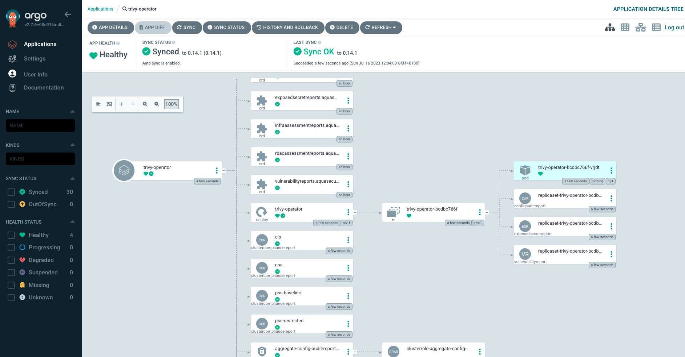

# Installation Options for the Trivy Operator

This repository showcases several different options for installing the [trivy-operator](https://github.com/aquasecurity/trivy-operator/tree/main).

## kubectl

**Prerequisites**

* kubectl installed
* access to a Kubernetes cluster

**Installation**

Follow the documentation: https://aquasecurity.github.io/trivy-operator/v0.14.1/getting-started/installation/kubectl/
Kubernetes resources: https://github.com/aquasecurity/trivy-operator/tree/main/deploy/static

## Helm 

**Prerequisites**

* kubectl installed
* helm installed
* access to a Kubernetes cluster

**Installation**

Follow the installation: https://aquasecurity.github.io/trivy-operator/v0.14.1/getting-started/installation/helm/
Helm Chart: https://github.com/aquasecurity/trivy-operator/tree/main/deploy/helm

## ArgoCD

**Prerequisites**

* kubectl installed
* helm installed
* access to a Kubernetes cluster

**Installation**

Install ArgoCD by following the getting started guide here:

Apply the Trivy-Operator installation manifest:

```
kubectl apply -f argocd
```

You should then be able to see the Trivy Operator thought the ArgoCD UI as managed by ArgoCD:



## Terraform 

**Prerequisites**

* kubectl installed
* the Terraform CLI installed
* access to a Kubernetes cluster

**Installation**

Follow these commands to install the Trivy Operator through Terraform:
```
cd terraform

terraform init

terraform plan

terraform apply
```


